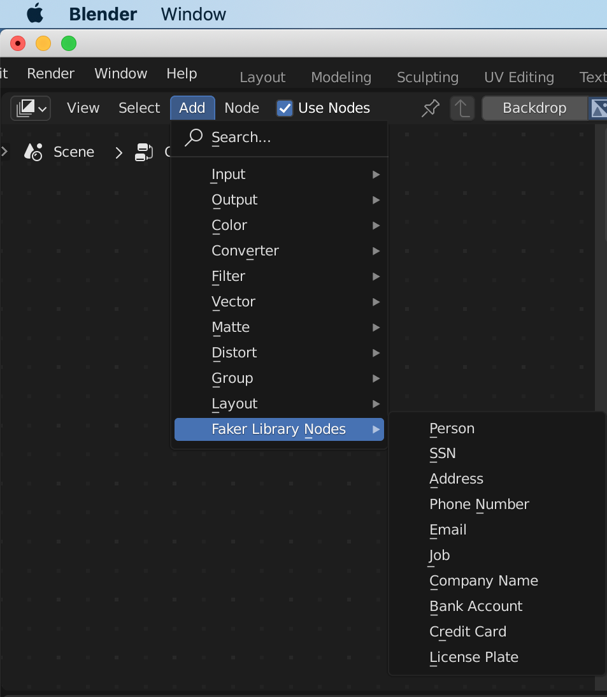

# Creation of Faker Library Add-on in Blender

### Objective

Create a Python Faker Library Add-on in Blender. 

### What is what?

* **Faker Library**

  *Faker* is a Python package that generates the **fake** data.

  The Python Faker Library has many standard providers, which can generate fake data for the following - Name, Address, Phone number, Credit card, Job, Company, Email and many more.

* **Blender**

  *Blender* is a **free** and **open source** software for 3D application. It has great tools for modelling, rendering, simulation, game and video applications.

* **Customization in Blender**

  *Blender* uses **Python** scripting language for its scripting. It's integrated deeply, used for writing **add-ons**, and generating user interface layouts.

  

---

### How to install python in Blender?

In the Python Interactive Console in Blender, do the following:-

> > > from pip._internal import main
> > >
> > > main['install', 'faker'])

---

### What are the Faker library providers used for Blender add-on?

| Blender Custom Node         | Faker Provider Names                                         |
| --------------------------- | ------------------------------------------------------------ |
| Custom Person Node          | fake.name()                                                  |
| Custom Social Security Node | fake.ssn()                                                   |
| Custom Address              | fake.building_number() fake.stree_name() fake.city() fake.postcode() |
| Custom Phone Number         | fake.phone_number()                                          |
| Custom Email                | fake.email()                                                 |
| Custom Job                  | fake.job()                                                   |
| Custom Company              | fake.company() fake.company_suffix()                    |
| Custom Bank Account         | fake.ban() - routing number fake.bban() - account number |
| Custom Credit Card          | fake.credit_card_provider() fake.credit_card_number() fake.credit_card_expire() fake.credit_card_security_code() |
| Custom License Plate        | fake.license_plate()                                         |

---

### Snapshot of Faker Library Add-on in Blender

### Snapshot of Blender's Custom Node for Faker providers

