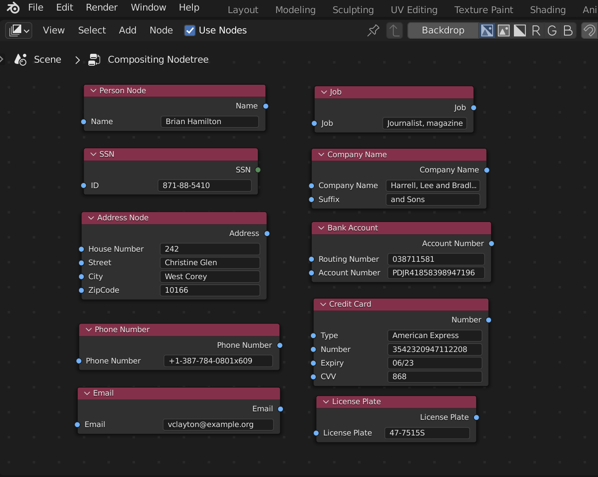

# Integration of Faker Library with Blender

### Objective

Build data pipeline using Python Faker Library with Blender.

### What is what?

* **Faker Library**

* **Blender**

* **Customization in Blender**

  

---

### How to install python in Blender?

---

### Snapshot of Faker Library Add-on in Blender

### Snapshot of Blender's Custom Node for Faker providers

